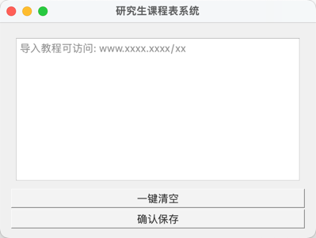
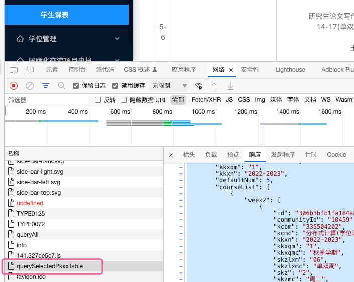

# 课程表
由于研究生课程无法使用"超级课程表"之类的APP，查看每周的课程,所以打算自己尝试开发一个课程表APP。

## TODO
- [x] 课程信息与课程表位置对应；
- [x] 完整显示一张课表信息；
- [x] 初始信息设置界面；
- [ ] 将信息文件保存为隐藏文件
- [ ] 打包为mac app 或者 Win可执行文件；
- [x] 多门课但不同周的如何同时显示，如周六的课；
- [x] 事件触发更新界面显示；
- [ ] 只显示本周课表；
- [ ] 潜在隐患1：数据解析太乱，但现在正常运行就先不动；

## 使用过程
### 首次使用
如果是首次使用，会先出现如下界面，要求导入课程信息的Json格式；

从教务网站导入课程信息，将响应里的json数据，完整复制到上面的窗口中后，点击确认保存，直接生成课表；

- 非首次使用：
  - 只有第一次需要，导入课表信息，之后就正常使用，打开即为当前课表。

> 导入操作，目前只支持zzu，其他大学需要重写analyseCInfo_test.py文件；

## 界面设计
课表总览：

## 课程信息与课程表位置对应
设计图-01

前提:

- 需要先将每一个课程表UI控件，以字典方式对应，如周一第一、二节的key："week1_12"，value: 对应位置的UI控件。

定位过程:
1. 从课程信息中拼凑key，eg"week1_12"。
2. 从字典中获取（定位）对应的UI控件。
3. 将课程的详细信息在对应UI控件中设置。

## 事件触发更新UI显示内容
- 每一个界面都是一个对象；
- 页面访问的第一个界面即为main入口；
- 通过绑定（链接）事件（函数）进行页面跳转；
- 明显可以感觉到UI开发明显不是面向过程。