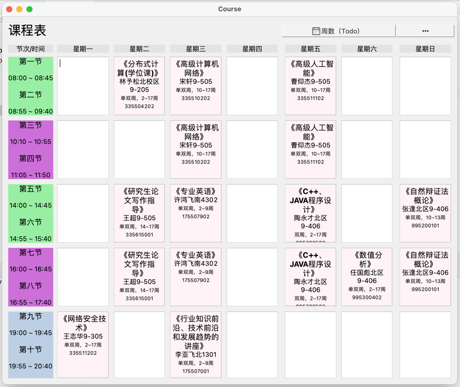
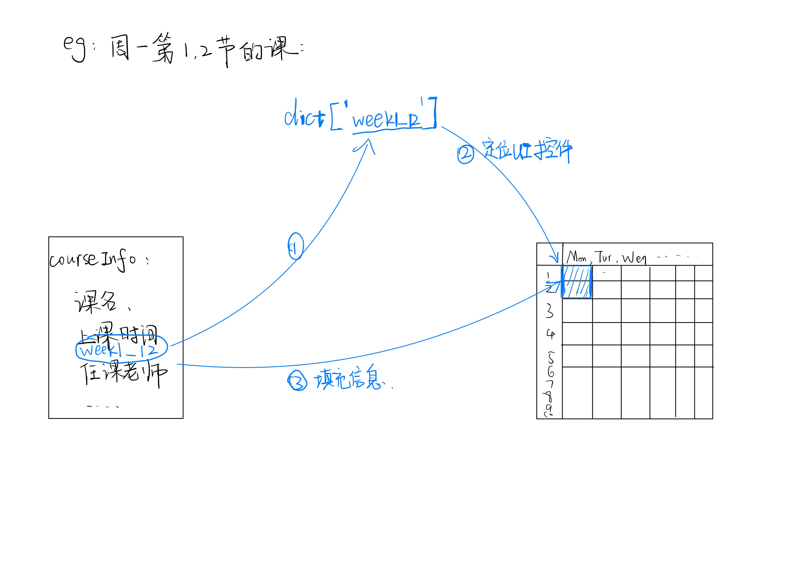

# 课程表
由于研究生课程无法使用"超级课程表"之类的APP，查看每周的课程,所以打算自己尝试开发一个课程表APP。

## TODO
- [x] 课程信息与课程表位置对应；
- [x] 完整显示一张课表信息；
- [ ] 初始信息设置界面；
- [ ] 打包为mac app 或者 Win可执行文件；
- [ ] 多门课但不同周的如何同时显示，如周六的课；
- [ ] 事件触发更新界面显示；
- [ ] 只显示本周课表；

## 界面设计
课表总览：

## 课程信息与课程表位置对应
设计图-01

前提:

- 需要先将每一个课程表UI控件，以字典方式对应，如周一第一、二节的key："week1_12"，value: 对应位置的UI控件。

定位过程:
1. 从课程信息中拼凑key，eg"week1_12"。
2. 从字典中获取（定位）对应的UI控件。
3. 将课程的详细信息在对应UI控件中设置。

## 事件触发跟新UI显示内容